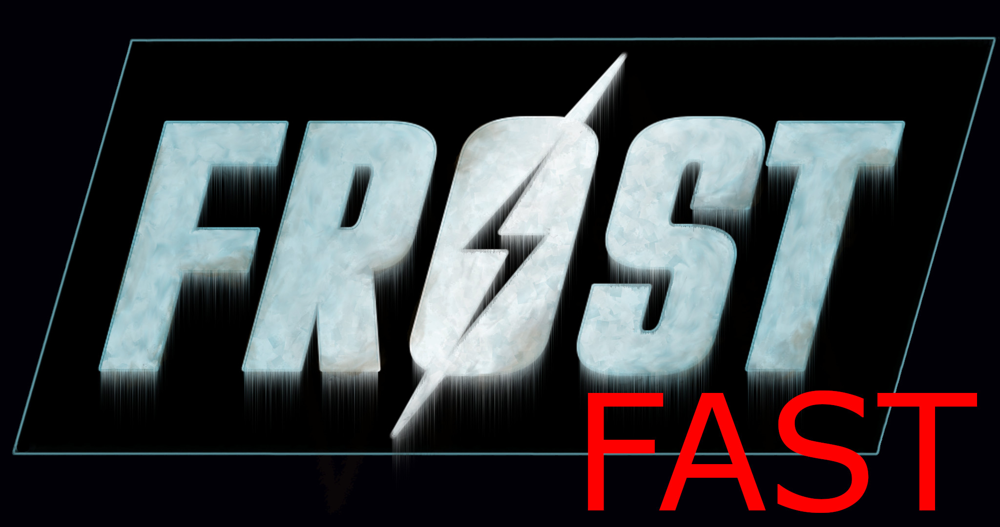

# FROST Fast

- [Preamble](#preamble)
- [Installation](#installation)
  - [Install Microsoft Visual C++ Redistributable Package](#install-microsoft-visual-c-redistributable-package)
  - [Steam Config](#steam-config)
    - [Disable the Steam Overlay](#disable-the-steam-overlay)
    - [Disable the Steam Cloud](#disable-the-steam-cloud)
    - [Change Steam's update behavior](#change-steams-update-behavior)
    - [Set the game language to English](#set-the-game-language-to-english)
  - [Clean Fallout 4](#clean-fallout-4)
  - [Start Fallout 4](#start-fallout-4)
  - [Using Wabbajack](#using-wabbajack)
    - [Download Wabbajack](#download-wabbajack)
    - [Install the modlist](#install-the-modlist)
    - [Errors in Wabbajack](#errors-in-wabbajack)
      - [Wabbajack could not find my game folder](#wabbajack-could-not-find-my-game-folder)
  - [Post-Installation](#post-installation)
    - [Copy Game Folder Files](#copy-game-folder-files)
    - [Edit INI files](#edit-ini-files)
- [Starting FROST for the First Time](#starting-frost-for-the-first-time)
  - [MCM Configuration](#mcm-configuration)
- [Updating](#updating)
- [Included Mods](#included-mods)
- [FAQ](#faq)
- [Removing the Modlist](#removing-the-modlist)
- [Credits and Thanks](#credits-and-thanks)
- [Contact](#contact)
- [Changelog](#changelog)

# Preamble

**FROST Fast** is a Wabbajack modlist for Fallout 4.

The modlist revolves around [FROST](https://www.nexusmods.com/fallout4/mods/18898), a total conversion mod which replaces vanilla quests and NPCs to create a more freeform survival experience. There is new lore, new enemies, and new gameplay systems. Your only goal in FROST is to survive... good luck!

This modlist incorporates many fixes, quality-of-life mods, and a few immersion-related changes.

# Installation

These steps will guide you through installing **FROST Fast** for the first time.

If you need to update an existing version of **FROST Fast**, then please jump straight to [Updating](#updating).

## Install Microsoft Visual C++ Redistributable Package

This package is required for Mod Organizer 2. It is likely that you already have this package installed, but if not, go ahead and install it now.

You can download this package directly from [Microsoft](https://support.microsoft.com/en-us/help/2977003/the-latest-supported-visual-c-downloads). Select the x64 version under "Visual Studio 2015, 2017 and 2019". [Here is the direct download link.](https://aka.ms/vs/16/release/vc_redist.x64.exe)

## Steam Config

Right click on _Fallout 4_ in your Steam library and select _Properties_.

### Disable the Steam Overlay

In the _General_ tab, un-tick the checkbox for _Enable the Steam Overlay while in-game_.

The Steam Overlay can cause issues with ENB, so it is recommended to be turned off. While this modlist does not contain ENB, you might want to add your own choice of ENB later.

### Disable the Steam Cloud

In the _General_ tab, un-tick the checkbox for _Keep game saves in the Steam Cloud for Fallout 4_.

Save files generated by your modded game are not compatible with the base game.

### Change Steam's update behavior

Go to the _Updates_ tab. Under _Automatic Updates_, select the option _Only update this game when I launch it_.

Updates to Fallout 4 can break existing mods, so we want to make sure Steam does not automatically update the game.

### Set the game language to English

Go to the _Language_ tab. Make sure that _English_ is selected.

This modlist only supports the English language.

## Clean Fallout 4

If you have modded Fallout 4 in the past, then you must clean your game folder to prevent conflicts.

1. Uninstall the game through Steam
2. Delete the game folder, which should be C:\Program Files (x86)\Steam\steamapps\common\Fallout 4 by default
3. Delete the game's save/config folder, which should be C:\Users\yourname\Documents\My Games\Fallout4 by default
4. Reinstall the game through Steam

## Start Fallout 4

You should now have a clean installation, so you can proceed with a first-time run.

1. Start the game through Steam
2. Click on _Options_ in the game launcher window
3. Set the _Aspect Ratio_ and _Resolution_ to your monitor's native values
4. Set the other graphics settings according to your preferences and hardware
5. Click _OK_ when you are done
6. Click _Play_
7. Wait for the game to load, and exit when you see the main menu

## Using Wabbajack

### Download Wabbajack

Download the latest release of Wabbajack from [here](https://github.com/wabbajack-tools/wabbajack/releases).

Place the _Wabbajack.exe_ file in a new folder, e.g. C:\Wabbajack.

### Download the modlist

Download the latest release of **FROST Fast** from [Github](https://github.com/interworlder//releases). For your convenience, [here is the direct download link](https://github.com/interworlder/FROST-Fast/releases/download/v0.2.0/FROST.Fast.wabbajack). Feel free to save it in the same directory, e.g. C:\Wabbajack.

### Install the modlist

Keep in mind that downloading and installing the full modlist can take a very long time (depending on your system specs and connection speed).

1. Run Wabbajack.exe
2. Click on _Install From Disk_ and open the file _FROST-Fast.wabbajack_
3. Set the _Installation Location_ as C:\FROST-Fast\Install
4. Set the _Download Location_ as C:\FROST-Fast\Download
5. Click the Go/Start button
6. Follow any instructions from Wabbajack (sign into NexusMods, click the download buttons, etc.)
6. Wait for Wabbajack to finish -- this can take a very long time!

### Errors in Wabbajack

If you see errors, run Wabbajack again by following the above "Install the mods" steps again. Wabbajack will safely continue where it left off, and it will automatically re-try any mod downloads which failed.

#### Wabbajack could not find my game folder

Wabbajack will not work with pirated versions of the game. You must buy the game to use this tool.

## Post-Installation

### Copy Game Folder Files

Copy all of the files from C:\FROST-Fast\Install\MO2\Game Folder Files, and paste them directly into your game folder.

Your game folder should be C:\Program Files (x86)\Steam\steamapps\common\Fallout 4 by default in Windows.

### Edit INI files

lorem ipsum yo

## Starting FROST for the First Time

lorem ipsum yo

### MCM Configuration

lorem ipsum yo

## Updating

If this modlist has been updated, please read the [Changelog](#changelog) before doing anything else.

Backup your saves, but keep in mind that saves are often incompatible with a new version. Starting a new game is the safest option after updating.

**Note that Wabbajack will delete all files that are not part of the modlist when updating!**

Ready to update? Updating with Wabbajack is similar to the first-time installation. Select your Installation and Download Locations again, but make sure to tick the checkbox _Overwrite Installation_. Click the Go/Start button, and wait for Wabbajack to finish.

## Included Mods

  
Click to expand!

**Fallout 4 Script Extender (F4SE)**

Extends scripting functionality in Fallout 4.

**Buffout 4**

Fixes engine bugs and adds a crash logger.

**Unofficial Fallout 4 Patch**

**Mod Configuration Menu**

**FO4 Photo Mode**

Allows players to access an advanced screenshot tool.

**Realistic Ragdoll Force**

Bodies are less likely to fly away upon death.

**Realistic Ragdoll Force - Reduced Explosion Force**

Bodies are less likely to fly away due to an explosion.

**Raw Input - The Ultimate Mouse Sensitivity Fix**

Fixes mouse sensitivity and acceleration.

**High FPS Physics Fix**

Uncaps the framerate without breaking in-game physics.

**Vats over there - Increased V.A.T.S Distance**

Allows players to target enemies in VATS from a greater distance.

**LevelUpMenuEx**

Permits easier changes to the Perks menus by mods.

**PipboyTabs**

Permits easier changes to the Pipboy tabs by mods.

**Extended Dialogue Interface**

Removes hard-coded engine limitations for dialogue options. 

**DEF_UI Iconlibs Rescaled and Fixed - Colored**

Permits usage of colored icons for items.

**FallUI**

Improves all inventory interfaces.

**FallUI - HUD**

Allows players to customize their HUD using the MCM.

**FallUI - Workbench**

Improves the workbench interface.

**FallUI - Confirm Boxes**

Improves the confirmation boxes.

**FallUI - Map**

Improves and adds a lot of functionality to the Pipboy map.

**DavesMods - In Game ESP Explorer Maintenance**

Provides an easy way to add custom items to the player inventory for debugging purposes.

**Wasteland Illumination Shadow Version**

Adds a lot of pretty dynamic lights to the Wasteland, but it also carries a penalty to graphical performance.

**Boat to Spectacle Island**

**Nina's Proper Pipe Guns Replacer**

**2287 - Billboards and Posters - Decadent version**

Replaces the vanilla billboards and posters with immersive new ones.

**Ultra Interior Lighting**

**More Where That Came From - Diamond City Radio Edition**

More tracks for Diamond City Radio.

**Travis Begone**

Removes Travis from Diamond City Radio.

**Atomic Radio**

Adds a new radio station.

**VHF Repeater Realistic Ham Radio Replacer and Pip Boy Radio**

Adds a new radio station.

**Project Reality Footsteps**

Adds footstep and gear sounds when the player is moving.

**Barefoot Footstep Extended**

Adds footstep sounds when the player is moving but has no armor, which was not included with Project Reality Footsteps.

**Scavver's Toolbox**

Allows the player to break down junk into materials anywhere.

**Campsite - Simple Wasteland Camping**

Allows the player to sleep and save anywhere (if they are willing to craft and carry a sleeping bag).

**Far Harbor Trap Overhaul**

Makes traps more useful.

**Grab and Eat All-in-One**

Permits useful interactions with in-game objects: read note, equip weapon, eat/drink.

**NPCs Travel**

Adds NPCs which travel the world for immersion purposes. 

**Crossbows of the Commonwealth**

**Wattz Laser Gun**

**Fallout 3 10mm SMG**

**Fire Axe - A Standalone Melee Weapon**

**Murdering Chainsaw**

**Service Rifle**

**Unequip Pipboy**

Allows players to equip/unequip their Pipboy.

**Crafting Highlight Fix**

**Jump Grunt**

**Stimpaks help you breathe**

**Death effects Removed**

Removes the intense blur applied upon death.

**Screen Blur Removal - Low Health Only**

Removes the intense blur applied when the player's health is low, but still keeps the blur applied if their head is crippled.

**Real Time Death (No Slow mo) - 20 seconds**

Gives the player a sad moment to reflect on their most recent death.

**Smokeable Cigars - Cigarettes - Joints - With HardCore Auto Save**

Allows the player to save anywhere (if they are willing to use an addictive drug).

**Less Cigarette and Cigar Loot**

Reduces the vast amounts of nicotine which can be looted in the world.

**LooksMenu**

Improves the character creation interface.

**Winter Main Menu Animated - For snowy and frosty players - Menu 2**

**FROST Survival Simulator**

**FROST Sanity Tab**

Adds a tab to the Pipboy for checking your current sanity level.

**FROST - Workshop DLC Patch**

**Realistic melee range and killmove (Frost supported)**

Makes melee combat feel better by adjusting melee weapon ranges to be more intuitive.

**Alternative Farming for FROST**

Makes farming of food crops in settlements possible in FROST.

**FROST Unofficial Updates**

**FROST - Nuka World AddOn**

**FROST - Nuka World AddOn - Performance Patch**

**Freeze Intimidation Overhaul**

Makes intimidation of enemies more viable in FROST.

**FROST Better Crossbow Weapon Patch**

**FROST Wattz Laser Rifle Patch**

**FROST - Fallout 3 10mm SMG Patch**

**FROST - Fire Axe Patch**

**FROST - Murdering Chainsaw Patch**

**FROST - Service Rifle Patch and Replacer**

**FROST Survival Kit**

Allows players to craft useful items like a Leg Splint anywhere. 

**FROST - Accessible ArcJet**

**Alliance and Federation Fatigues retexture**

**FROST Downtown Linked Workbenches**

**Frost Downtown Monohome**

Adds a player home to Downtown. If the radio is too much, open the console, select it, and use the "disable" command.

**Frost Plus v0.4.5 (WIP)**

**Frost Plus v0.4.5 (WIP) - Battlecoat Fix**

**Frost Plus v0.4.5 (WIP) - Bottleback**

Returns bottles to the player when crafting boiled water.

**Frost Plus v0.4.5 (WIP) - Lootable Cars**

**FROST - More Starting Locations**

**FROST - Eleanor Restored as Vendor**

**FROST - It Snowed - Winter Textures**

**FROST - Snowy Weathers**

**FROST - Dark Calling - Supermutant Locations Overhaul**

**FROST - Hunkered Down - Commonwealth Overhaul**

**Frost - Dogmeat resurrected**

Adds the option of recruiting an immortal canine companion who helps the player stay sane, making FROST easier. 

**See-Through-Scopes**

Improves vanilla weapon scopes.

**Patch - FROST and See Through Scopes (Replacer Version)**

**FROST - Unofficial Boston FPS Fix**

**Satellite World Map**

Improves the Pipboy map of the Commonwealth.

**Far Harbor Satellite Map**

**Nuka-World Satellite Map**

**FROST - Interior Cell Fixes**

**FROST - Interior Cell Fixes - Ultra Interior Lighting Patch**

**FROST - Interior Cell Fixes - FROST Plus Patch**

**Ruddy88's Simple Sorter**

This ESP is not required and therefore disabled, but I am including it just in case someone wants to generate their own item sorting list using Complex Sorter.

**FROST Fast - Complex Sorter List**

This is a Complex Sorter list generated specifically for the FROST Fast modlist.

## FAQ

lorem ipsum yo

## Removing the Modlist

lorem ipsum yo

## Credits and Thanks

lorem ipsum yo

## Contact

lorem ipsum yo

## Changelog

lorem ipsum yo
